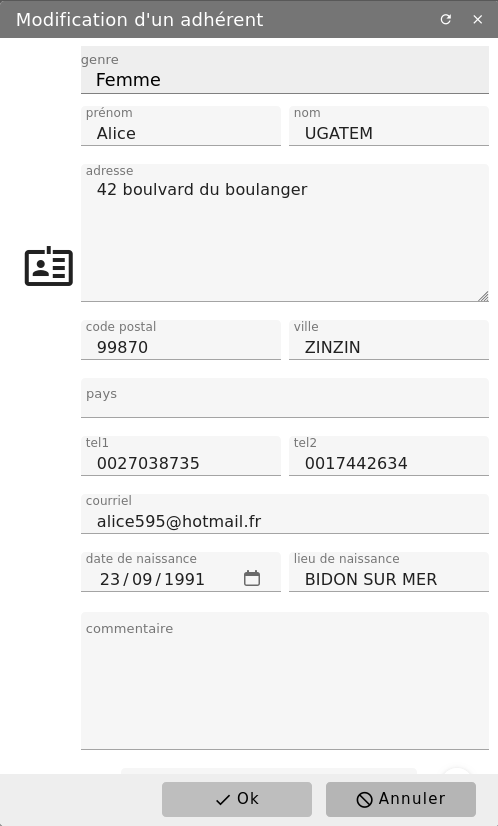

L’adhérent
==========

L'adhérent est une personne physique qui a pris une inscription dans votre association.
Consultez la liste de vos adhérents :

     Menu *Association/Adhérents/Adhérents cotisants*

De cet écran vous pouvez, après avoir filtré vos adhérents sur un ou plusieurs critères, imprimer les listes, les étiquettes ou les cartes d'adhérents.
Sélectionnez et éditez une ligne pour consulter la fiche de l'adhérent.

*Diacamma Asso* sauvegarde plusieurs types d'informations relatives à un adhérent. Vous pouvez les consulter dans la fiche de l'adhérent.

Cette fiche comporte :
 - L'identité de l'adhérent : nom, prénom, adresse, téléphone, date et lieu de naissance...
 - La liste de ses adhésions
 - D'autres onglets dépendent des extensions installées : liste des diplômes/formations/grades ou situation comptable

Si vous avez défini une liste de documents d'inscription pour la saison, vous pouvez, de manière individuelle, cocher les documents rendus. Une impression de l'état de l'ensemble des adhérents en la matière est disponible depuis la liste des adhérents.
Etant donné qu'un adhérent est aussi une personne physique, vous retrouvez ces même fiches depuis la liste des contacts. Il vous est également possible de promouvoir un simple contact physique en adhérent ; vous aurez alors juste à compléter sa fiche d'adhérent.
Enfin, depuis la fiche d'un adhérent, il est possible de lui donner un droit d'accès, ou alias, à *Diacamma*. (voir Les utilisateurs).

En fonction de vos droits de connexion, il vous sera possible de modifier l'identité d'un adhérent, d'ajouter une adhésion passée ou un diplôme obtenu.

**Attention:** La loi Informatique et liberté n'autorise la conservation de données que si elles sont relatives à l'activité de nos adhérents. Veillez donc à bien adapter vos commentaires à ce cadre législatif et à informer toute personne de son inscription dans votre base de données.
Consultez le texte de loi en cas de doute, et n'hésitez pas à contacter la CNIL en cas de besoin.

