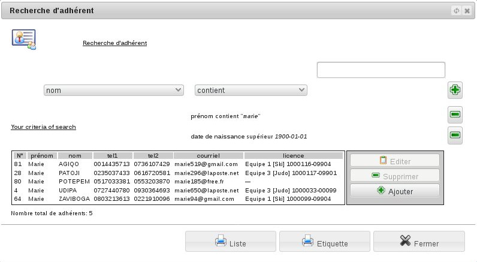

Rechercher un adhérent
======================

L'outil de recherche des adhérents se situe dans le menu *Association/Adhérents/Recherche d'adhérents*.

Vous pouvez alors faire une recherche suivant des critères variés portant sur l'identité ou les adhésions.
Vous pouvez également rechercher des adhérents suivant un des critères des 'documents demandés' ou d'un champ personnalisé.

**Remarque:** si vous faites une recherche avec des critères lié à un cotisation (équipe, documents, numéro licence, ...) n'oubliez pas de préciser la saison de recherche.
Le résultat donne une liste d'adhérents correspondants aux critères fournis.

Il est possible de fusionner plusieurs fiches d'une même personne en une seule.
Pour cela vous devez préciser la personne principale, l'outil supprimera les autres fiches après avoir déplacé toutes leurs références sur l'enregistrement principal.
Si vous voulez supprimer un adhérent, celui-ci ne devra pas avoir eu d'activité.

Depuis l'outil de recherche, vous pouvez aussi rechercher les fiches adhérents doublons. Cela vous permet d'afficher la liste des adhérents ayant nom et prénom similaire.
De là, vous pouvez également fusionner ou supprimer la ou les fiches redondantes.
