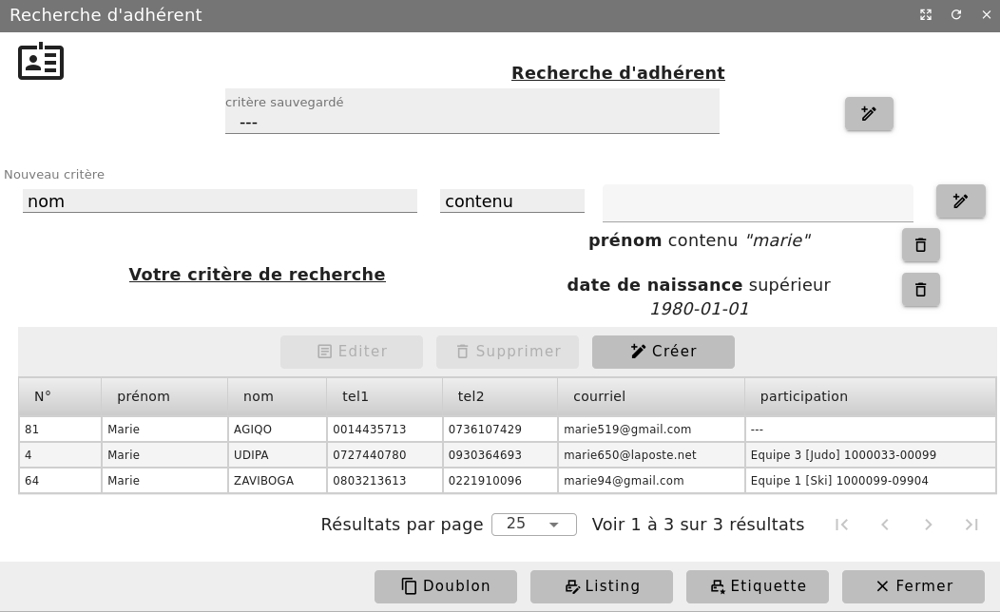

Rechercher un adhérent
======================

     Menu *Association/Adhérents/Recherche d'adhérents*

Vous pouvez alors faire une recherche suivant des critères variés portant sur l'identité ou les adhésions.
Vous pouvez également rechercher des adhérents sur des 'documents demandés' ou sur un champ personnalisé.

**Remarque:** si vous faites une recherche avec des critères liés à une cotisation (équipe, documents, numéro licence, ...) n'oubliez pas de préciser la saison de recherche. Le résultat donne une liste d'adhérents correspondant aux critères fournis.

Il est possible de fusionner plusieurs fiches d'une même personne.
Pour cela vous devez préciser la personne principale, l'outil supprimera les autres fiches après avoir déplacé toutes leurs références sur l'enregistrement principal.
Si vous voulez supprimer un adhérent, celui-ci ne devra pas avoir eu d'activité.

Depuis l'outil de recherche, vous pouvez aussi rechercher les fiches adhérents doublons. Cela vous permet d'afficher la liste des adhérents ayant les nom et prénom similaires.
De là, vous pouvez également fusionner ou supprimer la ou les fiches redondantes.
